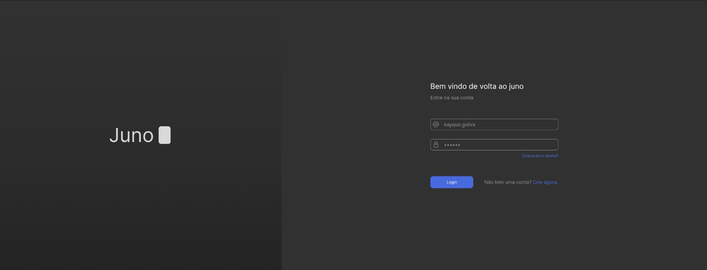
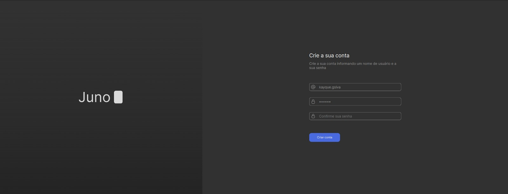
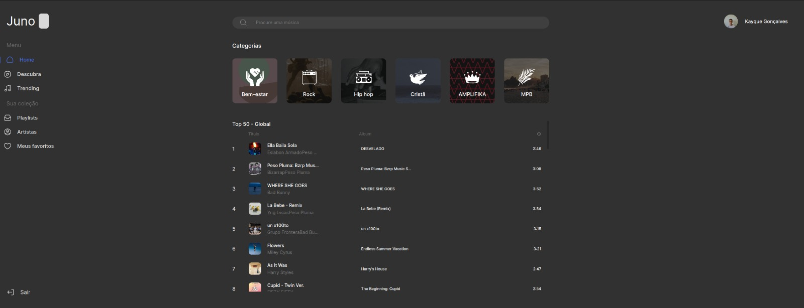
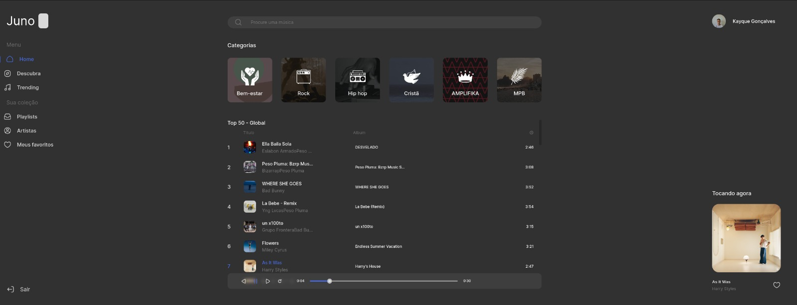

<h1 align="center">
    Juno
</h1>

## Sobre o projeto
Projeto desenvolvido para a matéria de Projeto de desenvolvimento de aplicações multiplaformas, do curso de ciências da computação da faculdade UNINOVE

O projeto consiste em um player de música em aplicação web. Para a realização do projeto foi utilizada a 
[API](https://developer.spotify.com/documentation/web-api) disponibiilizada pelo spotify, que permite utilizar os recursos
da plataforma, para criação de aplicações de uso acadêmico e de testes para desenvolvedores.

A utilização da API do spotify permite que a aplicação reproduza todas as músicas que são exibidas, porem, são tocados
apenas os previews das músicas (*recorte da música com apenas 30 segundos*), pois para a execução da música completa é necessario
a instalação do SDK da plataforma e assinatura do recurso Premium.

A aplicação possui apenas 3 telas (Home, Login e Cadastro). Para acessar a aplicação o usuário deve fazer o cadastro.

### Requisitos
É necessário ter instalado na sua máquina o [nodejs](https://nodejs.org/en) na sua versão `18.12.0` ou superior, assim como é necessário 
o gerenciador de pacotes [npm](https://www.npmjs.com/) na sua versão `8.19.2` ou superior.

Tratando se de uma aplicação utilizando uma api de terceiros, é necessário que você tenha uma conta registrada no 
[spotify](https://www.spotify.com/br-pt/signup?forward_url=https%3A%2F%2Fopen.spotify.com%2F) para que seja
feita a autenticação e permissão de uso. Estarei disponibilizando uma conta criada apenas para acesso caso não tenha uma conta.

```
    conta: kayqueg.silva@uni9.edu.br
    senha: SharedAcc4637!
```

### Técnologias utilizadas
Para o desenvolvimento completo da aplicação foi utilizado o [react](https://react.dev/) `18.2.0`, com o superset de js 
[typescript](https://www.typescriptlang.org/) `4.9.5` com a estilização sendo feita atravez da biblioteca 
[styled-components](https://styled-components.com/) `5.3.10`. Para o servidor e banco de dados foi utilizada a biblioteca 
[json-server](https://www.npmjs.com/package/json-server) `0.17.3`.

Outras ferramentas e bibliotecas utilizadas:
```agsl
    {
        axios: 1.4.0,
        bcryptjs: 2.4.3,
        buffer: 6.0.3,
        eslint: 8.43.0,
        lodash: 4.17.21,
        rc-slider: 10.2.1,
        react-dom: 18.2.0,
        react-router-dom: 6.13.0,
        react-scripts: 5.0.1,
    }
```

## Building
Siga as instruções abaixo para fazer a instalação e rodar o aplicativo no seu dispositivo.

**🚧 É preciso executar os dois scripts abaixo para a aplicação funcionar corretamente. 🚧**

```bash
    // no seu terminal execute os comandos abaixo

    $ git clone https://github.com/Kayque-Goncalves/juno.git
    $ cd my-app
    $ npm install
    
    // após a conclusão da instalação, execute o seguinte comando para iniciar o servidor do client
    
    $ npm run start
```

Executando o código acima você tera acesso ao cliente da aplicação diretamente da sua máquina acessando no seu navegador
a página `http://localhost:3000`.

Uma vez que o cliente está rodando, precisamos iniciar o servidor da aplicação, execute o comando abaixo:
```bash 
    // dentro da mesma pasta do projeto onde clonamos o repositorio anteriormente, abra outro terminal e execute
    
    $ cd my-app
    $ npm run server
```
Ao executar o código, a aplicação irá iniciar o servidor, ele pode ser acessado em `http://localhost:4000`.


## Páginas
Aqui estão os previews das páginas do aplicativo

### Login


### Cadastro de usuário


### Home (Sem o player tocando música)


### Home (Com o player tocando música)



